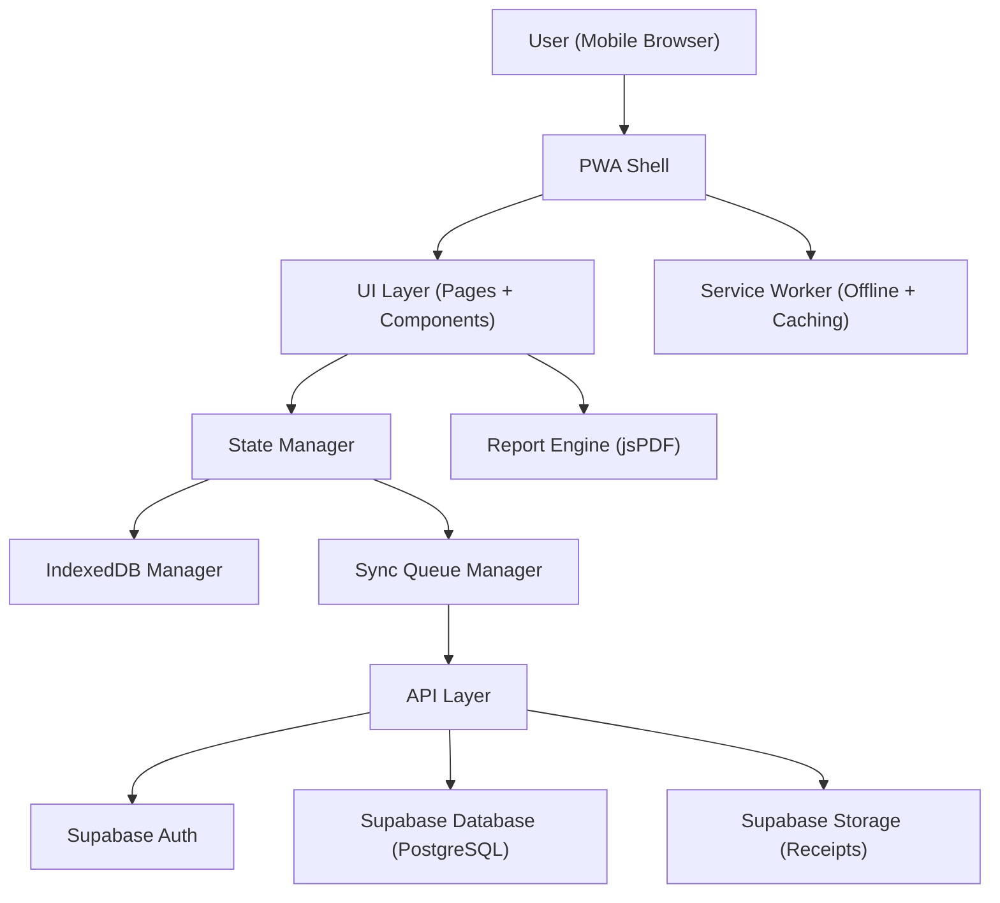

# ReceiptVault — Implementation Plan

> **"Snap. Tag. Report. Done."**
> Mobile-first PWA for freelancers and small business owners to log expenses in under 10 seconds.

---

## Product Summary

ReceiptVault is an offline-first, mobile-first Progressive Web App (PWA) built on Supabase (Auth, PostgreSQL, Storage) and deployed on Vercel. Users can capture receipts, categorize expenses, view dashboard insights, and generate PDF/CSV reports — all with zero setup friction and full offline reliability.

---

## User Review Required

> [!IMPORTANT]
> **Technology choice**: Your docs mention "modern frameworks (e.g. React)" but don't lock in a specific framework. This plan proposes **vanilla HTML/CSS/JS as a PWA** per the README's tech stack (Supabase + jsPDF + Vercel). If you want React/Next.js instead, let me know before I begin — it would change the project scaffold significantly.

> [!IMPORTANT]
> **Design tokens completeness**: Many primitive color palette values in `design-tokens.tokens.json` are currently `#ffffffff` (placeholder white). The color roles reference these palettes via `var()`. Before building UI screens, you should update the JSON with your actual Figma palette values and re-run `node Src/convert-tokens.js` to regenerate `design-tokens.css`.

> [!WARNING]
> **Currency**: The forms spec defaults to NGN (Nigerian Naira). Confirm this is the single currency for MVP (no multi-currency per excluded scope).

> [!WARNING]
> **Recurring expenses**: Listed as "Should Build" in MVP feature list but has a detailed form spec in `forms.md`. Confirm if this should be included in MVP Phase 1 or deferred to Phase 2.

---

## Proposed Architecture



---

## Proposed Changes

### Phase 0 — Project Foundation & Design System
*Estimated effort: 1–2 days*

The scaffold, design tokens, and shared infrastructure everything else depends on.

---

#### [MODIFY] [design-tokens.tokens.json](file:///c:/Users/User/ReceiptVault/docs/design-tokens.tokens.json)
- Update placeholder palette values (`#ffffffff`) with actual Figma colors
- Re-run `convert-tokens.js` to regenerate CSS

#### [MODIFY] [design-tokens.css](file:///c:/Users/User/ReceiptVault/Src/design-tokens.css)
- Regenerated output with real palette values

#### [NEW] `Src/styles/base.css`
- CSS reset/normalize
- Import Google Font (Poppins)
- Import `design-tokens.css`
- Base element styling using token variables
- Responsive breakpoints
- Utility classes (visually-hidden, sr-only, etc.)

#### [NEW] `Src/styles/components.css`
- Reusable component styles: buttons, cards, inputs, toasts, banners, badges, modals
- States: loading, disabled, error, success
- Touch target enforcement (44×44px minimum)

#### [NEW] `Src/index.html`
- PWA-ready `<head>` (manifest link, meta tags, theme-color)
- App shell structure: header, main content area, bottom navigation
- `<noscript>` fallback

#### [NEW] `Src/manifest.json`
- PWA manifest: name, icons, display: standalone, start_url, theme_color, background_color

#### [NEW] `Src/sw.js`
- Service Worker: cache-first for static assets, network-first for API calls
- Offline page fallback
- Cache versioning strategy

#### [NEW] `Src/assets/icons/`
- App icons (192×192, 512×512) for PWA install
- Inline SVG icon registry per iconography spec

---

### Phase 1 — Core Data Layer & Offline Engine
*Estimated effort: 2–3 days*

The entire offline-first system: IndexedDB, sync queue, and Supabase integration.

---

#### [NEW] `Src/js/db/indexeddb-manager.js`
- Initialize IndexedDB with object stores: `expenses`, `categories`, `projects`, `sync_queue`, `receipts`
- CRUD operations for each store
- UUID generation (client-side) per component spec
- Record state fields: `id`, `user_id`, `created_at`, `updated_at`, `sync_status`, `is_deleted`, `deleted_at`
- Soft delete support (`is_deleted = true`)

#### [NEW] `Src/js/sync/sync-queue.js`
- FIFO queue with `retry_count` and `status` per item
- Dependency enforcement: expense must sync before receipt upload
- Skip logic: failed 3× → mark failed, continue queue
- Queue recovery on app restart
- Exponential backoff: `wait(2^retry_count)` seconds
- Anti-spam: debounce rapid retry clicks

#### [NEW] `Src/js/sync/sync-processor.js`
- Process queue items sequentially when online
- Network stability check: wait 3–5 seconds of stable connection before syncing
- Conflict resolution: compare `updated_at` timestamps, server wins ties
- Idempotent operations using client-generated UUIDs
- Update `sync_status` after each item (pending → syncing → synced | failed)
- Bulk sync endpoint support (`POST /sync`)

#### [NEW] `Src/js/api/supabase-client.js`
- Initialize Supabase client (URL + anon key from config)
- Auth helpers: sign up, sign in, sign out, get session, refresh token
- Database query wrappers with RLS enforcement
- Storage helpers: upload receipt, get signed URL
- Request validation and rate-limit awareness
- Standard response format parsing (`status`, `code`, `data`, `message`)

#### [NEW] `Src/js/api/api-handlers.js`
- Expense CRUD: create/upsert, get (paginated), delete (soft)
- Receipt: upload (atomic with temp→permanent flow), get signed URL
- Category: list (system + user), create
- Project: list, create
- Constraints enforcement: note ≤ 500 chars, image ≤ 2MB, pagination max 100

#### [NEW] `Src/js/state/state-manager.js`
- Global reactive state: user session, network status, sync status, current view
- Event-driven updates (pub/sub pattern)
- State priority resolution: error > loading > syncing > empty > data
- Offline detection via `navigator.onLine` + request timeout tracking

---

### Phase 2 — Authentication
*Estimated effort: 1 day*

---

#### [NEW] `Src/pages/login.html` + `Src/js/pages/login.js`
- Email + password login form
- Real-time validation (email format, password ≥ 8 chars)
- Form lock on submit (prevent double-tap)
- Error feedback: "Your session expired. Please log in again."
- Redirect to expense form on success
- OAuth button placeholder (for future)

#### [NEW] `Src/pages/register.html` + `Src/js/pages/register.js`
- Registration form: full_name, email, password
- All fields required, inline validation
- Account creation → auto-login → redirect to Add Expense
- No onboarding steps (straight to value)

#### [NEW] `Src/js/auth/auth-guard.js`
- Route protection: redirect unauthenticated users to login
- Session persistence and refresh
- Handle auth errors: redirect to login, preserve local data
- Token expiry detection

---

### Phase 3 — Expense Entry (Core Feature)
*Estimated effort: 2–3 days*

The primary user flow — must complete in **<10 seconds**.

---

#### [NEW] `Src/pages/expense.html` + `Src/js/pages/expense.js`
- **Add Expense Form**: amount (required), category (required), date (default today), project (optional), note (optional, max 200 chars), receipt (optional)
- Numeric keypad auto-opens for amount input
- Amount formatting (e.g., ₦3,500)
- Category tiles with last-used pre-selected
- Inline "Add Category" option
- Currency hidden field (default: NGN)
- **Submission flow** per forms spec:
  1. Validate → 2. Lock form → 3. Generate UUID → 4. Save to IndexedDB → 5. Set `sync_status = pending` → 6. Queue sync → 7. Unlock → 8. Success toast → 9. Undo option (5 sec)
- **Edit mode**: pre-fill data, update locally, queue update
- **Receipt handling**: compress to JPEG/WebP, max 5MB, set `receipt_status = pending`, queue upload after expense syncs

#### [NEW] `Src/js/utils/image-compressor.js`
- Client-side image compression (~0.5–1MB target)
- Fallback to original if compression fails
- Format: JPEG or WebP
- Size validation (reject >5MB)

#### [NEW] `Src/pages/categories.html` + `Src/js/pages/categories.js`
- List categories (system + custom)
- Create new category (name required, unique, ≤ 100 chars, case-insensitive)
- Edit mode support
- Local-first save + sync queue

#### [NEW] `Src/pages/projects.html` + `Src/js/pages/projects.js`
- List projects
- Create/edit project (name required)
- Local-first save + sync queue

---

### Phase 4 — Dashboard
*Estimated effort: 2 days*

Must load in **<2 seconds**.

---

#### [NEW] `Src/pages/dashboard.html` + `Src/js/pages/dashboard.js`
- **Metrics**: total spending (last 30 days), category breakdown, daily trends
- **Charts**: pie chart (category), bar chart (daily spending) — using Canvas API or a lightweight chart lib
- Chart colors must clearly distinguish categories per colors spec
- Load from local data first → render immediately → sync in background → silent UI update
- Never wait for backend, never show blank screen
- Show sync state indicator (syncing, offline)
- **Empty state**: "No data to display" + CTA "Add Expense" (replace charts with placeholder, keep layout)
- **Stale data**: refresh after sync, partial updates only (no flicker)

---

### Phase 5 — Expense List & Filtering
*Estimated effort: 1–2 days*

---

#### [NEW] `Src/pages/expenses-list.html` + `Src/js/pages/expenses-list.js`
- Paginated expense list (default 20, max 100)
- Default sort: latest first
- **Filters**: category, date range, amount range, project
- **Search**: keyword search in notes/descriptions
- Per-item sync status indicator (pending → clock, syncing → spinner, synced → check, failed → retry)
- Per-item receipt status indicator
- Swipe/tap to edit, delete (soft delete)
- **Empty states** (per empty-state spec):
  - First-time user: "No expenses yet" + CTA
  - Returning user with zero data: "No expenses available" + CTA
  - Filtered with no results: "No matching expenses" + CTA "Clear Filters"
  - Search with no results: search-specific empty state
- Never render blank list — always show state component

---

### Phase 6 — Reports & Export
*Estimated effort: 1–2 days*

Must complete in **≤3 taps**.

---

#### [NEW] `Src/pages/reports.html` + `Src/js/pages/reports.js`
- **Report form**: start_date, end_date (required), categories (multi-select, optional), project (optional), include_receipts (toggle)
- Validation: `start_date ≤ end_date`
- Pre-generation check: if data not fully synced → warning banner + "Sync Now" option
- **Empty state**: if no data in range → block generation, show guidance
- **PDF generation** (jsPDF, client-side):
  - Content: date, description, category, project, amount
  - Totals: category subtotals, grand total
  - Metadata: user name, date range
  - Optional: include receipt images
- **CSV export**: Date, Amount, Category, Project, Note, Receipt Attached (Y/N)
- Downloadable + shareable output

---

### Phase 7 — Notifications & Feedback System
*Estimated effort: 1–2 days*

---

#### [NEW] `Src/js/ui/notification-manager.js`
- **Toast notifications**: auto-dismiss 2–4 sec, non-blocking, rate-limited (max 1 per 2 sec)
- **Inline status indicators**: pending, syncing, synced, failed, permanent_failure
- **Banner notifications**: persistent, dismissible, reappears if issue persists
- **Deduplication**: by type + reference_id + time window (5 sec)
- **Priority**: errors > warnings > success > info
- **Grouping**: batch similar events ("3 items failed to sync")
- **Network stability**: debounce online/offline changes (2–3 sec)
- **Notification log**: stores recent important messages (message, type, reference_id, timestamp)
- **Actionable**: retry, view item buttons where applicable

---

### Phase 8 — Error Handling & Empty States
*Estimated effort: 1 day*

---

#### [NEW] `Src/js/errors/error-handler.js`
- **Error classification**: validation, network, storage, server, sync, auth, permission
- **Priority system**: auth > storage > network > server > sync > validation
- **Single active error**: only one primary error visible at a time
- **Human-readable messages**: "We couldn't save your changes. Check your internet and try again."
- **Retry protection**: max 3 retries, exponential backoff, debounce rapid clicks
- **Visibility rules**: min 2 sec display, stay until resolved/dismissed
- **Aggregation**: "X items need attention" with detail drill-down
- **Offline awareness**: suppress server errors when offline, show network state only
- **Background error visibility**: failed sync → visible badge
- **App restart recovery**: reload failed operations, re-display unresolved errors

#### [NEW] `Src/js/ui/empty-state-resolver.js`
- State priority: error > loading > syncing > empty > data
- **Sync timeout protection**: MAX_SYNC_WAIT = 5 seconds → fallback state
- **Data validation layer**: verify local_data_checked AND sync_attempted before showing empty
- **Flicker protection**: 300ms delay before empty evaluation
- **Partial data awareness**: show available data + "More data syncing…"
- **Self-healing**: retry sync automatically, re-evaluate after every sync
- **Context-specific**: first-time user, returning user, filtered, search, dashboard, report, offline

---

### Phase 9 — Polish & Accessibility
*Estimated effort: 1–2 days*

---

#### [NEW] `Src/js/ui/icon-registry.js`
- Centralized icon → action mapping (add → plus, delete → trash, etc.)
- Inline SVG, optimized paths
- Sizes: small (16px), medium (20px), large (24px)
- Accessibility: auto-generate `aria-label` from registry, `role="img"`
- Touch target: wrap in 44×44px container
- Fallback: text label if icon fails to load
- Theme safety: inherit color from text, validate contrast

#### Global Accessibility Pass
- All interactive elements: unique IDs, proper ARIA labels
- Semantic HTML5 elements throughout
- Keyboard navigation support
- Screen-reader compatible error messages
- Color not sole indicator for any state
- Proper heading hierarchy (single `<h1>` per page)

#### Performance Optimization
- Lazy-load receipt images
- Limit dashboard data window (30 days)
- Enforce image compression before upload
- Minimize DOM operations during sync updates
- Service worker cache optimization

---

### Phase 10 — Supabase Backend Setup
*Estimated effort: 1 day*

---

#### [NEW] `backend/schema.sql`
Database tables with RLS:

```sql
-- Users (managed by Supabase Auth)
-- Expenses
CREATE TABLE expenses (
  id UUID PRIMARY KEY,
  user_id UUID REFERENCES auth.users NOT NULL,
  amount DECIMAL NOT NULL CHECK (amount > 0),
  category_id UUID NOT NULL,
  project_id UUID,
  note VARCHAR(500),
  expense_date DATE NOT NULL,
  receipt_url TEXT,
  receipt_status VARCHAR(20) DEFAULT 'none',
  sync_status VARCHAR(20) DEFAULT 'synced',
  is_deleted BOOLEAN DEFAULT false,
  deleted_at TIMESTAMPTZ,
  created_at TIMESTAMPTZ DEFAULT now(),
  updated_at TIMESTAMPTZ DEFAULT now()
);

-- Categories, Projects (similar pattern)
-- Row Level Security policies on all tables
```

#### [NEW] `backend/rls-policies.sql`
- User-scoped data access policies
- Insert/select/update/delete restricted to `auth.uid() = user_id`

#### [NEW] `backend/storage-config.md`
- Supabase Storage bucket: `receipts`
- File type restrictions: image only
- Max file size: 2MB (after compression)
- Signed URL generation for secure access

---

## File Structure Summary

```
ReceiptVault/
├── docs/                          # Documentation (existing)
├── Skills/                        # Specifications (existing)
├── Src/
│   ├── index.html                 # App shell
│   ├── manifest.json              # PWA manifest
│   ├── sw.js                      # Service Worker
│   ├── design-tokens.css          # Generated tokens (existing)
│   ├── convert-tokens.js          # Token converter (existing)
│   ├── styles/
│   │   ├── base.css               # Reset + globals + tokens
│   │   └── components.css         # Reusable component styles
│   ├── js/
│   │   ├── app.js                 # App initialization + router
│   │   ├── db/
│   │   │   └── indexeddb-manager.js
│   │   ├── sync/
│   │   │   ├── sync-queue.js
│   │   │   └── sync-processor.js
│   │   ├── api/
│   │   │   ├── supabase-client.js
│   │   │   └── api-handlers.js
│   │   ├── auth/
│   │   │   └── auth-guard.js
│   │   ├── state/
│   │   │   └── state-manager.js
│   │   ├── ui/
│   │   │   ├── notification-manager.js
│   │   │   ├── empty-state-resolver.js
│   │   │   └── icon-registry.js
│   │   ├── errors/
│   │   │   └── error-handler.js
│   │   ├── utils/
│   │   │   └── image-compressor.js
│   │   └── pages/
│   │       ├── login.js
│   │       ├── register.js
│   │       ├── expense.js
│   │       ├── expenses-list.js
│   │       ├── dashboard.js
│   │       ├── categories.js
│   │       ├── projects.js
│   │       └── reports.js
│   ├── pages/
│   │   ├── login.html
│   │   ├── register.html
│   │   ├── expense.html
│   │   ├── expenses-list.html
│   │   ├── dashboard.html
│   │   ├── categories.html
│   │   ├── projects.html
│   │   └── reports.html
│   └── assets/
│       └── icons/
├── backend/
│   ├── schema.sql
│   ├── rls-policies.sql
│   └── storage-config.md
└── README.md                      # Existing
```

---

## Open Questions

> [!IMPORTANT]
> 1. **Framework**: Vanilla JS PWA (as README implies) or React? This plan assumes vanilla JS.
> 2. **Recurring expenses**: Include in initial build or defer?
> 3. **Design tokens**: When will the Figma palette values be filled in? Building UI before this means all colors will be white.
> 4. **Supabase project**: Do you already have a Supabase project created, or should the plan include project setup?
> 5. **Chart library**: Use lightweight library (Chart.js) or custom Canvas rendering for dashboard charts?
> 6. **Analytics**: Include PostHog integration in MVP or defer?

---

## Verification Plan

### Automated Tests
- Run the PWA through Lighthouse audit (target: 90+ on all categories)
- Validate service worker with offline simulation
- Test IndexedDB persistence across page refreshes
- Verify sync queue processes FIFO with retry logic
- Validate all forms against field rules (required fields, character limits)

### Manual Verification
- Complete expense entry flow in <10 seconds (timed)
- Dashboard loads in <2 seconds
- Report generation in ≤3 taps
- Full offline test: airplane mode → create expenses → go online → verify sync
- Test on low-end mobile device (responsive + performance)
- Cross-browser: Chrome, Safari, Firefox (mobile)
- PWA install + standalone mode verification

### Build Order Validation
Each phase will be tested before proceeding to the next:
1. **Phase 0**: Design system renders correctly in browser
2. **Phase 1**: IndexedDB CRUD + sync queue works offline
3. **Phase 2**: Auth flow complete with session persistence
4. **Phase 3**: Full expense entry cycle <10 seconds
5. **Phase 4**: Dashboard renders with local data
6. **Phase 5**: Expense list with filtering works
7. **Phase 6**: PDF/CSV report generates correctly
8. **Phase 7–8**: All notification + error states visible
9. **Phase 9**: Accessibility audit passes
10. **Phase 10**: Backend connected, RLS enforced, data syncs end-to-end
